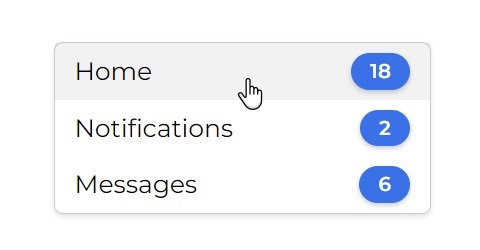

# Project Summary

## Promotional Email Interface — Sleek and User-Friendly Design

This project features an **elegant and visually appealing interface** for displaying promotional emails.

Developed using **HTML and CSS**, it showcases a **clean, modern layout** that effectively organizes email content for easy navigation.

<i>🔧 How is the project structured?</i>

The interface includes a container that acts as a  
**central hub for all promotional messages**.

Each message is presented as a **distinct card**, featuring:  
• Sender’s profile photo  
• Sender’s name  
• Timestamp  
• Subject line  
• A brief snippet of the email body

This layout offers a **quick and informative overview** of each message.

<i>🎨 A few words about styling</i>

The CSS is designed to enhance **both aesthetics and usability**.

It incorporates a **balanced use of colors, fonts, and spacing**, creating a  
**visually pleasing and accessible experience**.

Elements like **shadows and rounded corners** give the container and cards a  
**polished and contemporary appearance**.

 

<i>✅ Result</i>

This interface offers a **user-friendly and visually efficient way**  
to showcase promotional content — ideal for **individuals or businesses**  
aiming to improve their email marketing presentation.

---

## Engaging Social Following Interface — Connect with Furry Friends

This project introduces a **charming and user-friendly layout** for a social following experience.

Crafted with **HTML and CSS**, it presents a **bright and engaging design**  
that encourages users to **connect with their favorite animal profiles**.

<i>🔧 How is the project structured?</i>

A central container organizes **each animal profile into a row**.

Each row includes:  
• A standout profile image  
• A short description  
• A popularity indicator

This structure ensures a **clear, concise, and engaging experience** for users.

<i>🎨 A few words about styling</i>

Uses a **vibrant yet balanced color palette** for visual appeal.

Typography from the **Poppins font family** adds sophistication.

Design choices emphasize **readability and visual harmony** throughout.

 

<i>⭐ Standout features</i>

Each profile includes a **"Follow" button** with:  
• A modern, inviting look  
• Subtle hover animation for interactivity

This adds a **dynamic and user-friendly layer** to the interface.

 

<i>✅ Result</i>

This design delivers a **fun and immersive experience**,  
making it easy for users to **connect with animal profiles**  
through a **delightful and responsive interface**.

---

## Modern and Accessible Dashboard Experience

This project offers a **streamlined, modern dashboard layout**,  
carefully designed to deliver a **clear and intuitive user experience**.

Built with **HTML and CSS**, the layout provides a **professional interface**  
for presenting essential information effectively.

<i>🔧 How is the project structured?</i>

The layout includes a **centered container** for organizing multiple sections.

Each section is arranged in a **horizontal row format**,  
enriched with **interactive hover effects** for usability.

<i>🎨 A few words about styling</i>

Utilizes the **Montserrat font** for professional readability.

Features **rounded corners, shadows, and elegant spacing**  
to produce a **clean and polished appearance**.

 

<i>⭐ Standout features</i>

Each dashboard section displays **notification counters**  
inside **attention-grabbing circular badges**.

**Contrasting colors and hover animations**  
improve **visual hierarchy and user engagement**.

 
 

<i>✅ Result</i>

A **highly usable and visually structured dashboard**,  
ideal for **applications requiring organized, glanceable information**.

---

## Captivating Twitter Post Layout with Video Preview

This project introduces a **modern layout for social media posts**,  
highlighting an embedded **video preview for added engagement**.

Built with **HTML and CSS**, this layout ensures content is  
**clear, responsive, and interactive**.

<i>🔧 How is the project structured?</i>

A central container splits the layout into two sections:  
• Profile photo  
• Post content + video preview

This division improves **readability and visual flow**.

<i>🎨 A few words about styling</i>

Uses the **Roboto font** for a polished, clean appearance.

Implements **responsive design techniques** to support various screen sizes.

**Clean spacing and typography** improve the **visual hierarchy**.

<i>⭐ Standout features</i>

Integrates a **stylized video preview** with:  
• YouTube branding  
• Embedded metadata

This makes for a **natural, appealing video teaser**  
embedded within a tweet-style card.

 

<i>✅ Result</i>

A **polished and visually balanced social post layout**,  
perfect for **enhancing engagement** with multimedia content  
in a **familiar format**.

---

## Section: New Friend Pop-up

 
 
 

---

## Section: Search Interface

 
 
