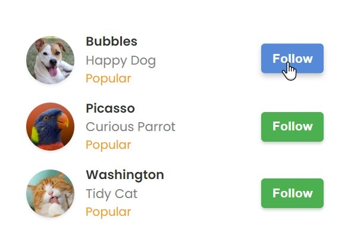

# Project Summary

## Promotional Email Interface: A Sleek and User-Friendly Design  ##

This project presents an **elegant and visually appealing interface for displaying promotional emails**.  

Built with HTML and CSS, the design showcases a **clean and modern layout** that   
effectively organizes and displays email content.

<i>How is the project structured?</i>

>The interface features a container that serves as a  
>**central hub for displaying all the promotional messages**.  

>Each message is represented by a **distinctive card-like structure**, which  
>includes the sender's profile picture, name, and the time the message was sent.  

>The subject line and a snippet of the email body are prominently displayed,  
>**providing users with a quick overview** of the message content.

<i>Few words about styles</i>

>The CSS styles employed in this project contribute significantly  
>to the **overall aesthetics and usability of the interface**.  

>The use of appropriate colors, typography, and  
>spacing creates a **visually pleasing and accessible experience**.  

>The container and message cards are styled with subtle shadows and rounded corners,  
>lending a **contemporary and polished look**.

 

<i>Result</i>

>With its **user-friendly design** and **attention to detail**,  

>this promotional email interface offers  
>an **efficient and visually appealing way**  
>to showcase and manage promotional messages,  

>making it an **ideal solution for businesses or individuals**  
>seeking to streamline their email marketing efforts.

## Engaging Social Following Interface: Connect with Your Favorite Furry Friends  ##

This project presents a **captivating and user-friendly interface**  
designed to showcase a social following experience.  

Built with HTML and CSS, the interface offers a **visually appealing layout** that  
**seamlessly displays profiles** of various animals,  
encouraging users to connect and follow their favorite furry companions.

<i>How is the project structured?</i>

>At the heart of this design lies a container that serves as  
>a **central hub, where each profile is elegantly presented in a row-like structure**.  

>Each row features a **striking profile image**, showcasing the endearing face of the animal.  

>Accompanying the image is a **concise yet informative section** that  
>displays the animal's name, a brief description.  

>And a popularity indicator, **providing users with an engaging glimpse into the profile's content**.

<i>Few words about styles</i>

>The CSS styles employed in this project contribute significantly  
>to the **overall aesthetics and usability of the interface**.  

>The **thoughtful use of colors**, such as the vibrant primary and secondary hues,  
>along with the accent color, creates a **visually appealing and harmonious experience**.  

>The typography, carefully curated from the Poppins font family,  
>adds a **touch of sophistication and readability** to the content.

 

<i>Standout features</i>

>One of the standout features of this design is the inclusion of  
>a **"Follow" button alongside each profile**.  

>This **interactive element, styled with a sleek and inviting appearance**,  
>encourages users to connect with their favorite animal profiles seamlessly.  

>The button's hover effect, which subtly **enhances its appearance** and  
>**introduces a delightful animation**, adds an engaging and  
>**responsive touch to the overall user experience**.

 

<i>Result</i>

>With its **captivating visuals, intuitive layout, and interactive elements**,  

>this social following interface offers a **delightful and immersive experience**,  
>allowing users to effortlessly discover and connect with their favorite animal companions.

## Modern and Accessible Dashboard Experience  ##

This project presents a **sleek and modern dashboard layout**,   
meticulously crafted to provide users with a seamless and intuitive experience.   

Built with HTML and CSS, the design showcases a **clean and visually appealing interface** that   
effortlessly organizes and displays essential information.

<i>How is the project structured?</i>

>At the core of this layout lies a **centered dashboard container**, which   
>serves as the focal point for displaying various sections.  

>Each section is represented by a **row-like structure**,   
>presenting the relevant information in a clear and concise manner.  

>The **rows are thoughtfully styled with subtle hover effects**,   
>inviting users to interact with the sections and explore further details.

<i>Few words about styles</i>

>The CSS styles employed in this project contribute significantly   
>to the **overall aesthetics and usability of the interface**.  

>The typography, carefully selected from the elegant Montserrat font family,   
>lends a sense of **professionalism and readability to the content**.  

>The subtle use of shadows and rounded corners adds depth and   
>a **modern touch to the dashboard container**,  

>creating a **visually appealing and polished look**.

 

<i>Standout features</i>

>One of the standout features of this design is   
>the **inclusion of notification counts alongside each section**.  

>These counts are prominently displayed within **eye-catching circular elements**,   
>instantly drawing the user's attention to areas that require their immediate focus.  

>The notification counts are styled with a **contrasting color scheme** and   
>**subtle hover effects**, further enhancing their visibility and interactivity.

 
 

<i>Result</i>

>With its **clean and organized layout, intuitive design elements, and attention to detail**,  

>this dashboard layout offers a **visually appealing and user-friendly experience**,  

>making it an **ideal choice for various applications** that   
>require efficient information organization and presentation.

## Captivating Social Media Post with Immersive Video Preview  ##

This project presents a **sleek and visually appealing layout for displaying Twitter posts**,  
seamlessly integrating video previews for an enhanced user experience.  

Crafted with HTML and CSS, the **design offers a clean and modern interface** that  
effectively showcases post content alongside captivating video teasers.

<i>How is the project structured?</i>

>The layout features a central container that serves as a **hub for displaying the Twitter post**.  

>Within this container, the post is **structured into two main columns**:  
> * one dedicated to the user's profile photo and  
> * the other containing the post's content and video preview.

<i>Few words about styles</i>

>The CSS styles employed in this project contribute significantly  
>to the **overall aesthetics and usability of the interface**.  

>The typography, selected from the Roboto font family,  
>ensures **optimal readability and a polished look**.  

>Additionally, the project incorporates **responsive design principles**,  
>ensuring that the Twitter post layout **adapts seamlessly to various screen sizes**.

<i>Standout features</i>

>One of the standout features of this design is  
>the **integration of a video preview section**.  

>This section **seamlessly incorporates the YouTube logo and video information**,  
>providing users with an enticing glimpse of the video content.  

 

<i>Result</i>

>With its **clean and organized layout,  
>seamless video preview integration, and responsive design**, this  

>Twitter post project offers an **engaging and visually appealing way** to  
>showcase social media content, providing users with a **seamless and enjoyable experience**.

## Section: New friend pop-up  ##

 
 
 

## Section: Search  ##

 
 
